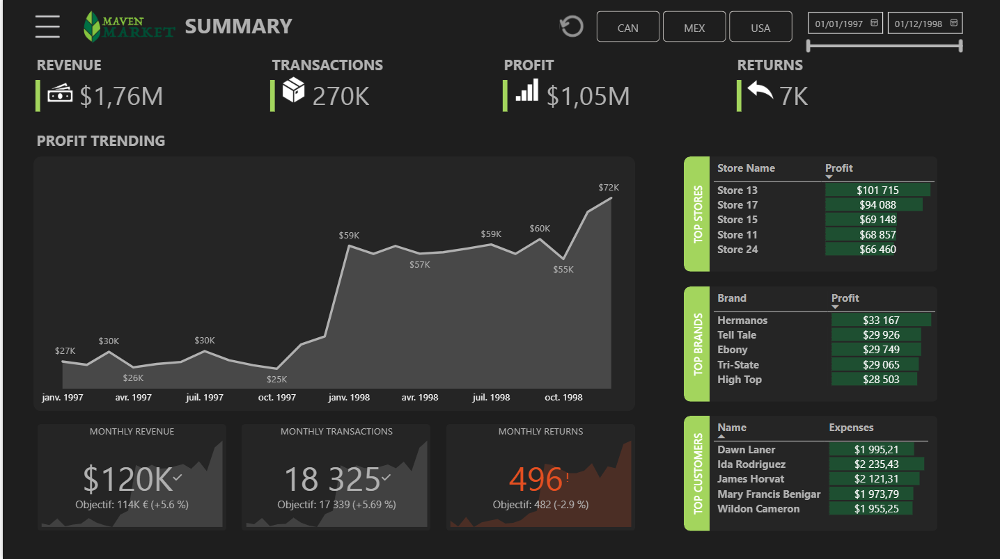

# Maven Market – Power BI Dashboard

## Project Overview
This project is a professional **Power BI dashboard** built from the Maven Market dataset.  
It simulates a real-life business case where a retail company needs to **monitor sales performance, customer behavior, and operational KPIs** across multiple countries and product categories.  

The goal is to provide a **user-friendly, interactive tool** for executives and analysts to quickly identify trends, compare regions, and track progress against business objectives.

---

## Business Case
**"As the BI Analyst of Maven Market, you have been asked by the executive team to design a dashboard that consolidates sales and customer data across different countries.  
The dashboard should allow managers to:**
- Track **monthly customer trends** and compare them across time.  
- Monitor **revenues, volumes, and profitability** across multiple markets.  
- Navigate smoothly between thematic pages using an **interactive menu bar**.  
- Provide actionable insights to support decisions on pricing, inventory, and marketing strategy."

---

## Dashboard Features
- **General KPI page**: Key metrics such as Revenue, Transactions or Profit.
- **Stores page**: Breakdown of performance by store with a map to compare across regions.  
- **Product insights**: Best-selling products, trends and targets.  
- **Customer insights**: Analysis of customer segmentation and trends.  
- **Interactive navigation**: Custom sidebar menu with bookmarks (web-app experience).  
- **Dynamic filters**: Slicers displayed as horizontal buttons for dates and countries.  

---

## Technical Details
- Tool: **Microsoft Power BI Desktop**  
- Techniques used:
  - DAX measures (e.g. `% Total Sales`, `Monthly Customers`, Margin calculations)  
  - Field Parameters for switching fields.  
  - Bookmarks & Selection Pane for building the navigation menu  
  - Conditional formatting & Data bars inside tables for professional KPIs presentation  
  - Custom theme aligned with the **Maven Market branding colors**  

---

## Dataset
The data comes from [Maven Analytics](https://www.mavenanalytics.io/), a well-known provider of practice datasets for BI and analytics.

---

## Screenshots
### Homepage

### Customers Page

### Products Page

### Stores Page

### Interactive Menu

## 📄 Deliverables
- **Power BI file**: `Maven_market.pbix`  
- **PDF export** of the dashboard for non-Power BI users (see `/docs/`)  
